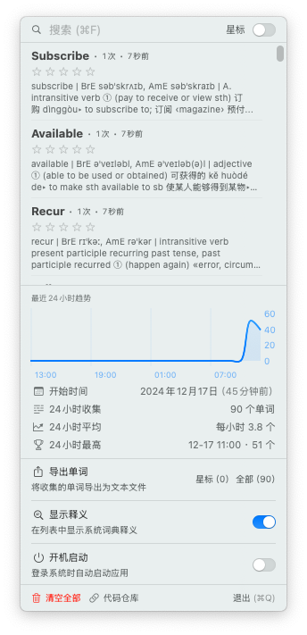

# VastWords

<div align="center">
  
</div>

[](https://github.com/ygsgdbd/VastWords/releases)
[](https://github.com/ygsgdbd/VastWords/blob/main/LICENSE)
[](https://github.com/ygsgdbd/VastWords)
[](https://swift.org)
[](https://developer.apple.com/xcode/)
[](https://developer.apple.com/xcode/swiftui)

VastWords 是一个 macOS 单词本应用，帮助你快速积累日常阅读中遇到的单词。它能够自动监听剪贴板中的英文单词，并提供系统词典查询功能。应用完全离线运行，所有数据均存储在本地，确保您的隐私安全。

<div align="center">
  
</div>

## 技术栈

- SwiftUI + MVVM 架构
- CoreData + CoreStore 数据持久化
- Vision 框架实现 OCR
- Natural Language 实现词形还原
- Combine + Async/Await 异步处理
- Tuist 项目管理
- SwiftLint + SwiftFormat 代码规范

## 项目结构

```
VastWords/
├── Project.swift           # Tuist 项目配置文件
├── Targets/               # 项目目标配置
└── Sources/              # 源代码目录
    ├── App/             # 应用入口
    ├── Models/          # 数据模型
    │   └── CoreData/    # CoreData 相关文件
    ├── Services/        # 业务服务层
    │   ├── Clipboard/   # 剪贴板监听服务
    │   ├── Dictionary/  # 词典查询服务
    │   └── OCR/         # 图片文字识别服务
    ├── ViewModels/      # 视图模型
    ├── Views/           # 视图组件
    └── Utils/           # 工具类
```

### 主要模块说明

- **App**: 应用程序入口和生命周期管理
- **Models**: 数据模型定义和 CoreData 实体
- **Services**: 核心业务逻辑实现
  - Clipboard: 剪贴板监听和文本处理
  - Dictionary: 系统词典集成和查询
  - OCR: Vision 框架集成和图片文字识别
- **ViewModels**: MVVM 架构中的视图模型层
- **Views**: SwiftUI 视图组件
- **Utils**: 通用工具类和扩展方法

## 项目构建

本项目使用 [Tuist](https://tuist.io) 进行项目管理和构建。

### 环境要求

- [Tuist](https://docs.tuist.io/tutorial/get-started) 3.0+
- Xcode 15.0+
- macOS 13.0+

### 构建步骤

1. 安装 Tuist - 请参考 [Tuist 安装文档](https://docs.tuist.io/documentation/tuist/installation)

2. 克隆项目
```bash
git clone https://github.com/ygsgdbd/VastWords.git
cd VastWords
```

3. 生成 Xcode 项目
```bash
tuist generate
```

4. 打开项目并构建
```bash
open VastWords.xcworkspace
```

## 功能特点

- 🔄 智能监听功能
  - 自动监听剪贴板中的文本
  - 支持图片自动 OCR 识别（使用系统内置 Vision 框架，离线且安全）
  - 自动提取英文单词
  - 智能还原单词原形（如 running → run, cities → city）
- 📚 集成 macOS 系统词典，实时查询单词释义
- ⭐️ 支持为重要单词添加星标
- 🔍 支持单词搜索和筛选
- 📊 展示最近 24 小时单词收集统计
- 📥 支持导出单词列表
- 🚀 支持开机自启动
- ⚡️ 高性能存储
  - 使用 CoreData 进行数据持久化
  - 支持快速检索和更新
  - 内存占用小，响应迅速
- 🎯 性能优化
  - 后台静默运行，低优先级处理
  - 智能资源管理，不影响其他应用
  - 内存占用小，CPU 使用率低

## 隐私与安全

- 🔒 完全离线运行，无需网络连接
- 💾 所有数据存储在本地，不会上传到云端
- 🛡️ 使用系统内置功能
  - Vision 框架进行图片 OCR
  - macOS 系统词典查询
  - Natural Language 框架进行词形还原
  - CoreData 高性能数据存储
- 🤝 不收集任何用户数据
- 📱 不需要任何权限，除了
  - 剪贴板访问（用于监听单词）
  - 开机自启动（可选）
- 💪 系统友好
  - 后台任务使用低优先级
  - 自动调节资源占用
  - 不影响用户正常工作

## 使用限制

- 文本长度上限为 10,000 字符
- 单词长度限制为 2-45 个字符
- 自动过滤常见功能词（如 a, the, in 等）

## 系统要求

- macOS 13.0 或更高版本
- Apple Silicon 或 Intel 处理器

## 开发环境

- Xcode 15.0+
- Swift 5.9+
- SwiftUI
- [Tuist](https://tuist.io) 3.0+

## 第三方依赖

- [CoreStore](https://github.com/JohnEstropia/CoreStore) - CoreData 数据库管理
- [Defaults](https://github.com/sindresorhus/Defaults) - 用户偏好设置存储
- [SwifterSwift](https://github.com/SwifterSwift/SwifterSwift) - Swift 扩展集合
- [SwiftUIX](https://github.com/SwiftUIX/SwiftUIX) - SwiftUI 功能扩展

## 许可证

本项目采用 MIT 许可证开源。这意味着你可以自由地使用、修改和分发本项目，但需要保留原始许可证和版权信息。详见 [LICENSE](LICENSE) 文件。

### 第三方许可证

本项目使用了以下开源组件：

- [CoreStore](https://github.com/JohnEstropia/CoreStore) - MIT License
- [Defaults](https://github.com/sindresorhus/Defaults) - MIT License
- [SwifterSwift](https://github.com/SwifterSwift/SwifterSwift) - MIT License
- [SwiftUIX](https://github.com/SwiftUIX/SwiftUIX) - MIT License 